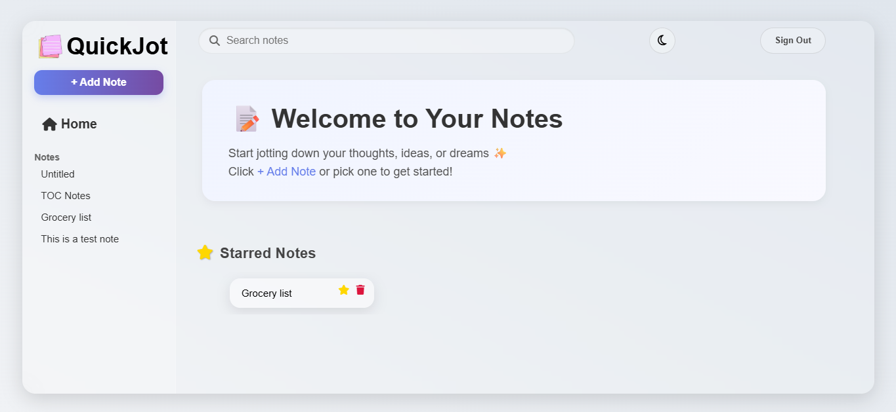
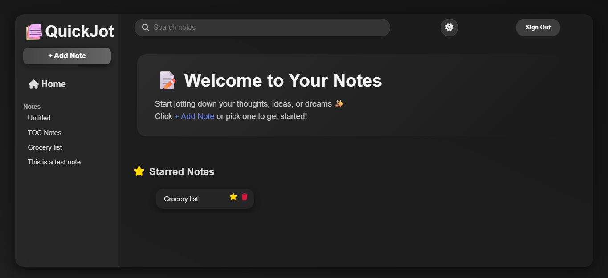
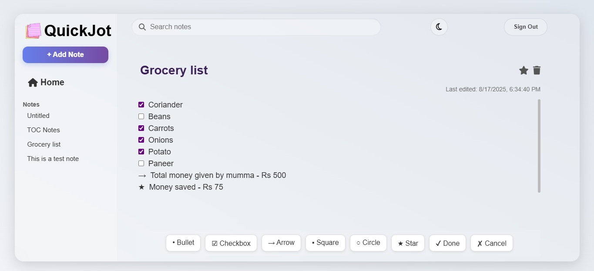
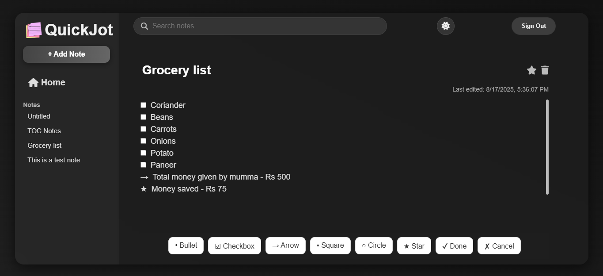
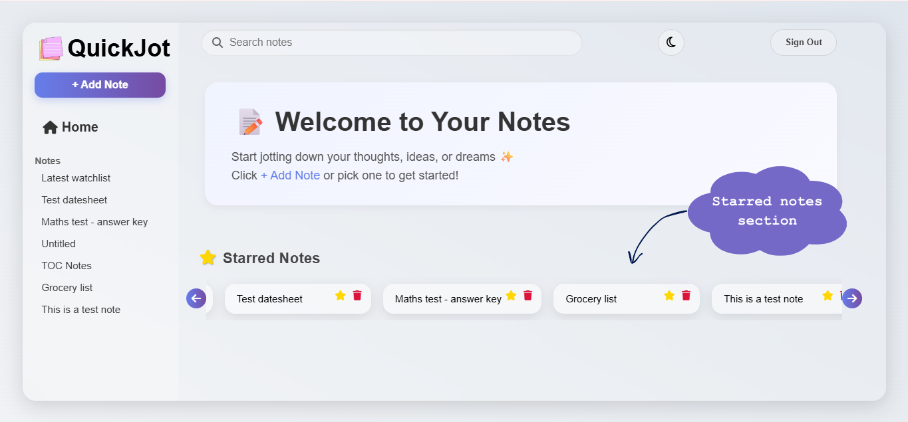
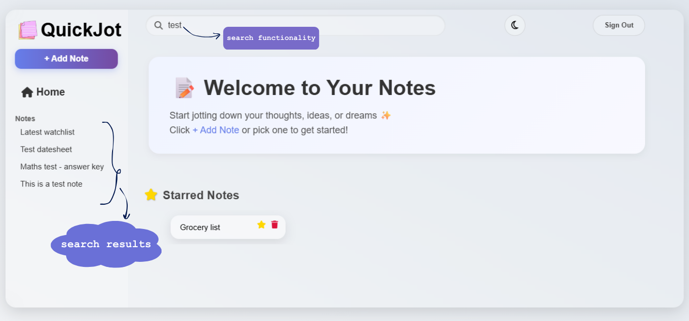

---

# QuickJot

**QuickJot** is a modern, lightweight, and intuitive **note-taking web app** built with **React** and **Vite**.
It’s designed for **daily use**, whether you want to quickly jot down ideas, manage a **to-do list**, or organize thoughts.

## ✨ Features

* 📝 **Create & Edit Notes** – Simple and clean note editor
* ⭐ **Starred Notes** – Mark important notes for quick access
* 🔍 **Search** – Instantly find your notes by title or content
* ✅ **Bullets & Formatting** – Easy structuring for to-dos & lists
* 🌙 **Dark / Light Mode** – Switch themes based on preference
* ⚡ **Fast & Responsive** – Powered by **React + Vite** for smooth performance
* 🗑️ **Delete Notes** – Remove unwanted notes with ease
* 💾 **Local Storage Support** – Notes persist even after closing the app

## 🛠️ Tech Stack

* **React** – Component-based UI
* **Vite** – Lightning-fast dev server & build tool
* **React Hooks** – State management (`useState`, `useEffect`)
* **Context API / Props** – For managing data between components
* **Font Awesome** – For icons (star, delete, etc.)
* **CSS (custom styles + modern UI)** – Clean and minimal design

## 🚀 Getting Started

### 1. Clone the repo

```bash
git clone https://github.com/rakshasinha1908/QuickJot.git
cd QuickJot
```

### 2. Install dependencies

```bash
npm install
```

### 3. Start development server

```bash
npm run dev
```

Now open the app at `http://localhost:5173`

### 4. Build for production

```bash
npm run build
```

Optimized build will be inside the `dist/` folder.

## 📂 Project Structure

```
QuickJot/
├── public/        # Static assets (favicon, logo, etc.)
├── src/
│   ├── components # React components (Sidebar, NoteEditor, MainSection, etc.)
│   ├── styles.css # Global styles
│   └── App.jsx    # Main app logic
├── index.html     # Entry point
├── package.json   # Dependencies & scripts
├── vite.config.js # Vite configuration
└── README.md
```

## 📸 Screenshots

### 🏠 Home Page
**Light Mode**



**Dark Mode**  



---

### 📝 Note Editor
**Light Mode**



**Dark Mode**



---

### ⭐ Starred Notes


---

### 🔍 Search



## 🤝 Contributing

Contributions, issues, and feature requests are welcome!
Feel free to fork this repo, create a branch, and submit a PR.


## 👩‍💻 Author

GitHub: [rakshasinha1908](https://github.com/rakshasinha1908)

LinkedIn: [Raksha Sinha](https://www.linkedin.com/in/raksha-sinha-7771b8278/)

Twitter/X: [rakshasinha__](https://x.com/rakshasinha__)

Email: rakshasinha1908@gmail.com

---